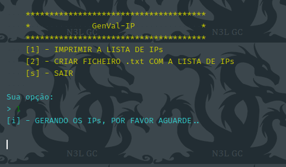

# GenVal-IP

```txt
simples script-programa que gera e valida endereços de IPs

- ele cria um endereço de IP atravez de uma combinação padrão
- verifica se o IP criado tem um DNS válido
- e cria uma lista organizada com uma quantidade de IPs pré definida
```

---

## Menu Principal



---
**_caso a sua conexão a internet esteja muito baixa ou não haver alguma \
o script é capaz de demorar uma ETERNIDADE para executar a acção desejada!_** 

&copy; 2019-2021 [Nurul Carvalho](mailto:nuruldecarvalho@gmail.com) \
&trade; [ArtesGC](https://artesgc.home.blog)
